## ~/sobre

Estudante de Engenharia de Computação na UFRN, trabalhando com DevOps e infraestrutura. Sou estagiário de DevOps na Aiyra Engenharia de Dados e, na incubadora inPACTA (ECT/UFRN), administro o cluster Proxmox de cinco nós que roda os MVPs das startups incubadas, com monitoramento em Zabbix e Grafana e deploy pelo GitLab CI.

Cheguei na infraestrutura vindo do desenvolvimento: foram dois anos como dev na LogAp, com Angular, Django e Spring Boot, e quatro anos de Iniciação Científica (CNPq) em IA aplicada à educação. Nesse período criei um bot educacional no Discord e depois uma plataforma integrada ao SIGAA, que juntos já foram usados por mais de 1000 estudantes e renderam três artigos publicados.

## ~/experiencia

<b>DevOps</b> · Aiyra Engenharia de Dados &nbsp;<code>estágio · 2026 → atual</code>

- Configuro e mantenho os ambientes de desenvolvimento, teste e produção com infraestrutura como código
- Construo e mantenho pipelines de CI/CD com deploy automatizado em produção
- Acompanho o desempenho dos sistemas com monitoramento contínuo e apoio a resolução de incidentes
- Uso containers para rodar os serviços de apoio e as suítes de teste das aplicações

<b>Infraestrutura e DevOps</b> · inPACTA (ECT/UFRN) &nbsp;<code>bolsista · 2026 → atual</code>

Cuido da infraestrutura própria da incubadora: é nela que rodam os MVPs das startups incubadas e os ambientes de professores e pesquisadores da ECT.

- **Consolidação do cluster:** juntei servidores que rodavam isolados num cluster Proxmox VE de cinco nós, com ZFS e containers LXC, incluindo um nó com GPU dedicada que os containers de pesquisa usam via passthrough
- **Ambiente pronto em um clone:** template Debian 12 com Docker, agente de monitoramento, chave SSH, limites de log e localização já configurados, então todo container novo já nasce padronizado e monitorado
- **Atualização com rollback:** migrei o Zabbix do 5.4 para o 7.0 LTS e o Grafana do 9.5 para o 13, subindo a versão nova em paralelo e mantendo a antiga pronta para voltar
- **Observabilidade:** dashboards do Grafana reorganizados numa visão única do cluster, com variáveis e repetição de painéis, e Uptime Kuma acompanhando a disponibilidade dos serviços
- **Entrega contínua:** GitLab próprio com pipelines de CI/CD e deploy automatizado dos MVPs em produção
- **Gestão de segredos:** Vaultwarden centralizando as credenciais da equipe

**Stack:** Proxmox VE, ZFS, LXC, Docker, Debian, Zabbix, Grafana, Uptime Kuma, GitLab CI/CD, Vaultwarden

<b>Desenvolvedor</b> · LogAp Sistemas &nbsp;<code>estágio · 2024 → 2026</code>

- Desenvolvi aplicações web e sistemas distribuídos, da análise à implantação
- Front-end em Angular; back-end em Django (Python) e Spring Boot (Java), com APIs REST e bancos relacionais
- Comunicação entre serviços com GraphQL, gRPC e RabbitMQ, e testes automatizados das APIs
- Sustentação de sistemas em produção de clientes do setor público: monitoramento, análise de incidentes, correção de falhas e otimização de desempenho
- Cuidei dos ambientes de desenvolvimento, teste e produção com infraestrutura como código e CI/CD, em time com Scrum e Kanban

<b>Iniciação Científica (CNPq)</b> · UFRN &nbsp;<code>bolsista · 2022 → 2026</code>

- Pesquisa em IA aplicada à educação: assistentes virtuais educacionais, PLN e IA generativa
- **Monitor Bot:** assistente no Discord em Python (discord.py, FastAPI, NLTK) com perguntas e respostas por similaridade de texto, minitestes ao vivo, registro de presença e análise das respostas para o professor. Virou [artigo](https://periodicos.ufrn.br/casoseconsultoria/article/view/33870) em que sou primeiro autor
- **Plataforma integrada ao SIGAA:** evolução do bot para avaliação contínua na disciplina de Lógica de Programação, com correção automática de código, quizzes ao vivo e retorno gerado por LLM nas questões discursivas. Feita com Angular, Django REST Framework, Django Channels, Redis, PostgreSQL, Docker e GitLab CI
- Somando o bot e a plataforma, **mais de 1000 estudantes** usaram as ferramentas nas turmas, com menos tempo de espera por retorno e menos sobrecarga da monitoria

## ~/stack

**Infraestrutura e DevOps**

+ Proxmox VE, ZFS, LXC, Zabbix, Uptime Kuma, Vaultwarden

**Backend e Dados**

+ gRPC, Django Channels

**Frontend**

