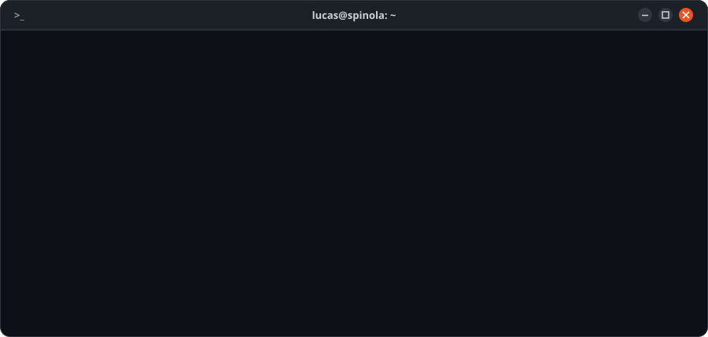
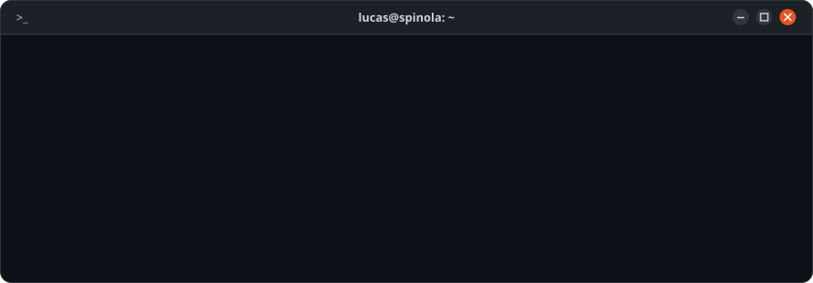

## ~/sobre

Estudante de Engenharia de Computação na UFRN, trabalhando com DevOps e infraestrutura. Sou estagiário de DevOps na Aiyra Engenharia de Dados, onde cuido dos ambientes de desenvolvimento, teste e produção com infraestrutura como código, das pipelines de CI/CD e do monitoramento das aplicações.

Fui responsável pela infraestrutura da inPACTA, a incubadora da ECT/UFRN, onde professores, alunos e startups dependem dos mesmos servidores. Estruturei um cluster Proxmox VE de cinco nós com ZFS e containers LXC, trazendo para dentro dele servidores que antes rodavam isolados, entre eles um com GPU NVIDIA dedicada à pesquisa, cujo passthrough precisou ser preservado sem derrubar o trabalho de quem usava. Para parar de configurar ambiente na mão, criei um template Debian com Docker, agente de monitoramento e limites de log já prontos: um ambiente novo passou a sair de um único clone, já monitorado. No fim, eram 42 containers servindo mais de 20 aplicações, entre elas mais de 15 MVPs de startups incubadas.

Implantei o Zabbix 7.0 LTS com Grafana por cima, num dashboard único com todos os nós lado a lado e alertas por e-mail. Foi por ele que apareceram problemas que ainda não davam sinal, como um container de produção perto de lotar o disco e o ZFS consumindo memória sem limite. Também entraram cofre de senhas com Vaultwarden, acompanhamento de disponibilidade com Uptime Kuma, acesso às aplicações pelo Nginx Proxy Manager com certificados automáticos, backups no Proxmox Backup Server e deploy dos MVPs por pipelines de CI/CD no GitLab. A parte menos visível foi revisar os acessos servidor por servidor, conferindo chaves SSH, credenciais e permissões, e migrando as senhas para o cofre.

Cheguei na infraestrutura vindo do desenvolvimento: foram dois anos como dev na LogAp, com Angular no front, Django e Spring Boot no back, e sustentação de sistemas em produção de clientes do setor público. Em paralelo, quatro anos de Iniciação Científica do CNPq em IA aplicada à educação, onde criei um bot educacional no Discord e depois uma plataforma integrada ao SIGAA para avaliação contínua, usados por mais de 1000 estudantes e com três artigos publicados.

## ~/stack

**Infraestrutura e DevOps**

**Backend e Dados**

**Frontend**

